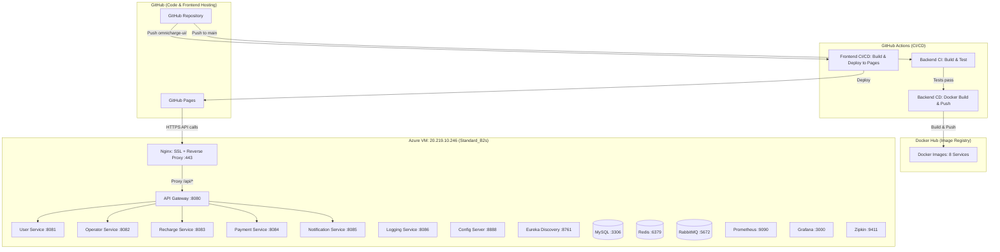
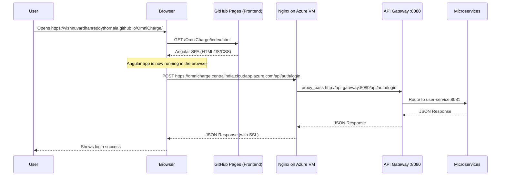
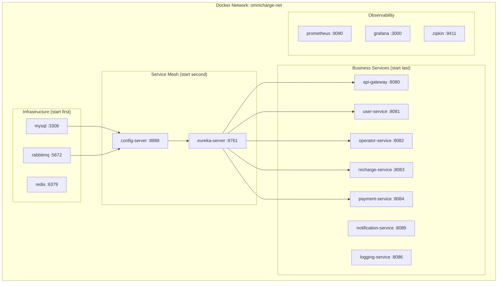
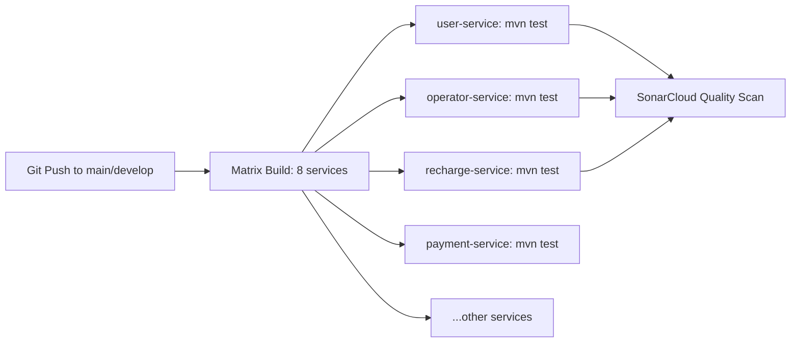
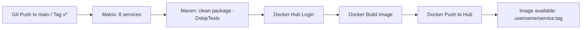
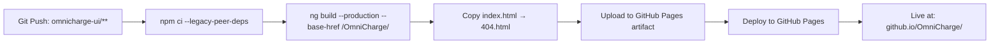

# OmniCharge — Azure Infrastructure & CI/CD Documentation

---

## 1. Infrastructure Overview

OmniCharge runs on a **hybrid cloud architecture** using two hosting platforms:

| Component | Hosted On | Why |
|---|---|---|
| **Frontend (Angular 17)** | GitHub Pages | Free static hosting with CDN, auto-deployed on every push |
| **Backend (9 Microservices)** | Azure VM (Docker Compose) | Full control over networking, containers, and SSL |
| **Databases (MySQL, Redis)** | Azure VM (Docker containers) | Co-located with backend for low-latency access |
| **Message Broker (RabbitMQ)** | Azure VM (Docker container) | Co-located for sub-ms event delivery |
| **Observability (Grafana, Prometheus, Zipkin, Loki)** | Azure VM (Docker containers) | Direct access to container metrics and logs |
| **Source Code & CI/CD** | GitHub + GitHub Actions | Free CI/CD with tight Git integration |
| **Docker Images** | Docker Hub | Public registry for storing built container images |

### Architecture Diagram



---

## 2. Azure VM Setup (Detailed)

### 2.1 VM Specification

| Property | Value |
|---|---|
| **VM Name** | `omnicharge-vm` |
| **Resource Group** | `omnicharge-rg` |
| **Region** | Central India |
| **Size** | Standard_B2s (2 vCPUs, 4 GB RAM) |
| **OS** | Ubuntu 22.04 LTS |
| **Public IP** | `20.219.10.246` |
| **DNS Label** | `omnicharge.centralindia.cloudapp.azure.com` |
| **Disk** | 30 GB Premium SSD |
| **Authentication** | SSH Key |

### 2.2 How the VM Was Created

```bash
# Step 1: Create Resource Group
az group create --name omnicharge-rg --location centralindia

# Step 2: Create the VM
az vm create \
  --resource-group omnicharge-rg \
  --name omnicharge-vm \
  --image Ubuntu2204 \
  --size Standard_B2s \
  --admin-username omnicharge \
  --generate-ssh-keys \
  --public-ip-sku Standard

# Step 3: Assign a DNS label to the public IP
az network public-ip update \
  --resource-group omnicharge-rg \
  --name omnicharge-vmPublicIP \
  --dns-name omnicharge
```

### 2.3 Network Security Group (NSG) — Open Ports

These ports were opened in the Azure NSG to allow external access:

| Port | Protocol | Purpose | Access |
|---|---|---|---|
| 22 | TCP | SSH access | Admin only |
| 80 | TCP | HTTP (redirects to 443) | Public |
| 443 | TCP | HTTPS (Nginx SSL) | Public |
| 3000 | TCP | Grafana Dashboard | Evaluation team |
| 9090 | TCP | Prometheus UI | Evaluation team |
| 9411 | TCP | Zipkin Tracing UI | Evaluation team |
| 15672 | TCP | RabbitMQ Management | Evaluation team |

```bash
# Example: Open port 443 for HTTPS
az vm open-port --resource-group omnicharge-rg --name omnicharge-vm --port 443 --priority 100
```

### 2.4 Software Installed on VM

```bash
# Docker Engine
sudo apt update && sudo apt install -y docker.io docker-compose-v2
sudo systemctl enable docker

# Certbot (SSL certificates)
sudo apt install -y certbot

# Add user to docker group
sudo usermod -aG docker omnicharge
```

---

## 3. How Backend & Frontend Are Connected

### 3.1 The Connection Flow



### 3.2 Where Each Part Lives

| Part | Location | URL |
|---|---|---|
| **Frontend Source Code** | `omnicharge-ui/` in GitHub repo | — |
| **Frontend Deployed** | GitHub Pages (auto-deployed by CI/CD) | `https://vishnuvardhanreddythornala.github.io/OmniCharge/` |
| **Backend Source Code** | `user-service/`, `payment-service/`, etc. in GitHub repo | — |
| **Backend Deployed** | Azure VM inside Docker containers | `https://omnicharge.centralindia.cloudapp.azure.com` |
| **API Docs (Swagger)** | Served by API Gateway on Azure VM | `https://omnicharge.centralindia.cloudapp.azure.com/swagger-ui/index.html` |
| **Config Files** | `config-repo/` directory mounted into config-server container | — |
| **Environment Secrets** | `.env` file on Azure VM at `/opt/omnicharge/.env` | Never committed to Git |

### 3.3 How Frontend Knows Where Backend Is

The Angular app uses **environment files** to configure the backend URL:

```
File: omnicharge-ui/src/environments/environment.ts (Development)
→ apiBaseUrl: 'http://localhost:8080'

File: omnicharge-ui/src/environments/environment.production.ts (Production)
→ apiBaseUrl: 'https://omnicharge.centralindia.cloudapp.azure.com'
```

When GitHub Actions builds the frontend with `--configuration production`, it uses the production environment file, which points all API calls to the Azure VM.

### 3.4 How Nginx Connects Frontend to Backend

Nginx runs inside the `omnicharge-ui` Docker container on the Azure VM and acts as the **SSL terminator and reverse proxy**:

```nginx
# Port 80: Redirect HTTP → HTTPS
server {
    listen 80;
    server_name omnicharge.centralindia.cloudapp.azure.com;
    location / {
        return 301 https://$host$request_uri;
    }
}

# Port 443: SSL + Reverse Proxy
server {
    listen 443 ssl;
    server_name omnicharge.centralindia.cloudapp.azure.com;

    ssl_certificate     /etc/letsencrypt/live/.../fullchain.pem;
    ssl_certificate_key /etc/letsencrypt/live/.../privkey.pem;

    # API requests → forwarded to API Gateway container
    location /api/ {
        proxy_pass http://api-gateway:8080/api/;
    }

    # Everything else → serve Angular static files
    location / {
        try_files $uri $uri/ /index.html;
    }
}
```

**Key Point:** Nginx and the API Gateway are on the same Docker bridge network (`omnicharge-net`), so Nginx can reach the gateway by container name `api-gateway`.

---

## 4. Docker Architecture

### 4.1 How Services Are Containerized

Every microservice has an identical Dockerfile pattern:

```dockerfile
# Lightweight Java 21 runtime (no full JDK)
FROM eclipse-temurin:21-jre-alpine

# Security: run as non-root user
RUN addgroup -S spring && adduser -S spring -G spring
USER spring:spring

# JVM optimized for containers
ENV JAVA_OPTS="-XX:+UseContainerSupport -XX:MaxRAMPercentage=75.0"

# Copy pre-built JAR
COPY target/*.jar app.jar

ENTRYPOINT ["sh", "-c", "java ${JAVA_OPTS} -jar /app.jar"]
```

### 4.2 Docker Compose — Container Orchestration

All containers run on a single Docker bridge network (`omnicharge-net`) and reference each other by **container name**:



### 4.3 Startup Order (enforced by `depends_on` + `healthcheck`)

```
Phase 1: mysql, redis, rabbitmq          (infra — must be healthy first)
    ↓
Phase 2: config-server                   (waits for rabbitmq healthy)
    ↓
Phase 3: eureka-server                   (waits for config-server healthy)
    ↓
Phase 4: api-gateway + all business      (waits for eureka + mysql + redis + rabbitmq)
         services start in parallel
    ↓
Phase 5: observability stack             (prometheus, grafana, zipkin — independent)
```

### 4.4 Environment Variables Flow

```
.env file (on VM)
    ↓ loaded by
docker-compose.yml (env_file: .env)
    ↓ injected into
Container environment variables
    ↓ read by
Spring Boot (${MYSQL_HOST}, ${JWT_SECRET}, etc.)
    ↓ combined with
Config Server properties (config-repo/*.properties)
    = Final application configuration
```

---

## 5. CI/CD Pipeline (GitHub Actions)

OmniCharge has **3 GitHub Actions workflows** that automate the entire build-test-deploy cycle.

### 5.1 Backend CI (`backend-ci.yml`)

**Trigger:** Push to `main` or `develop` branch when any backend service code changes.



**What it does:**
1. **Checkout** code from GitHub
2. **Setup JDK 21** (Temurin distribution with Maven caching)
3. **Matrix build:** Runs `mvn -B test` for each of the 8 services **in parallel**
4. **SonarCloud scan:** After all tests pass, runs full code quality analysis

**Path Filters:** Only triggers when files change in service directories:
```yaml
paths:
  - 'user-service/**'
  - 'operator-service/**'
  - 'recharge-service/**'
  - 'payment-service/**'
  - 'notification-service/**'
  - 'api-gateway/**'
  - 'discovery-server/**'
  - 'config-server/**'
```

### 5.2 Backend CD (`backend-cd.yml`)

**Trigger:** Push to `main` branch or a version tag (`v*`).



**What it does:**
1. **Build JAR:** `mvn clean package -DskipTests` (tests already passed in CI)
2. **Docker Hub login:** Uses `DOCKER_USERNAME` and `DOCKER_PASSWORD` secrets
3. **Build Docker image:** Uses each service's `Dockerfile`
4. **Push to Docker Hub** with tags: `main`, `v3`, and git SHA
5. **Special handling:** For `config-server`, copies `config-repo/` into the build context

**Docker image tags generated:**
```
username/user-service:main
username/user-service:v3
username/user-service:sha-abc1234
```

### 5.3 Frontend CI/CD (`frontend-ci-cd.yml`)

**Trigger:** Push to `main` branch when `omnicharge-ui/**` files change.



**What it does:**
1. **Install dependencies:** `npm ci --legacy-peer-deps`
2. **Production build:** `npm run build -- --configuration production --base-href /OmniCharge/`
3. **Fix SPA routing:** Copies `index.html` to `404.html` so Angular routing works on GitHub Pages
4. **Deploy:** Uses `actions/deploy-pages@v4` to publish to GitHub Pages

**Key configuration:**
```yaml
permissions:
  pages: write      # Allows deploying to GitHub Pages
  id-token: write   # Required for Pages authentication

concurrency:
  group: "pages"
  cancel-in-progress: true  # Only 1 deployment at a time
```

### 5.4 GitHub Secrets Required

| Secret | Used In | Purpose |
|---|---|---|
| `DOCKER_USERNAME` | Backend CD | Docker Hub login |
| `DOCKER_PASSWORD` | Backend CD | Docker Hub password |
| `SONAR_TOKEN` | Backend CI | SonarCloud code quality scan |
| `GITHUB_TOKEN` | All workflows | Auto-provided by GitHub Actions |

---

## 6. SSL Certificate (Let's Encrypt)

### How SSL Was Set Up

```bash
# Step 1: Generate free SSL certificate using Certbot
sudo certbot certonly --standalone \
  -d omnicharge.centralindia.cloudapp.azure.com \
  --agree-tos --email your-email@gmail.com

# Step 2: Certificate files are stored at:
#   /etc/letsencrypt/live/omnicharge.centralindia.cloudapp.azure.com/fullchain.pem
#   /etc/letsencrypt/live/omnicharge.centralindia.cloudapp.azure.com/privkey.pem

# Step 3: Mounted into Nginx container via Docker volume:
volumes:
  - /etc/letsencrypt:/etc/letsencrypt:ro
```

### Auto-Renewal

```bash
# Certbot auto-renewal is set up as a cron job
sudo crontab -e
# Add: 0 3 * * * certbot renew --quiet && docker restart omnicharge-ui
```

---

## 7. VM Management — Cost Optimization

### Deallocate VM (Stop Billing)

```bash
# From Azure Cloud Shell or local Azure CLI:
az vm deallocate --resource-group omnicharge-rg --name omnicharge-vm
# This STOPS all compute billing. Only disk storage charges continue (~$4/month).
```

### Start VM (Before Evaluation)

```bash
# Step 1: Start the VM
az vm start --resource-group omnicharge-rg --name omnicharge-vm

# Step 2: SSH into the VM
ssh omnicharge@20.219.10.246

# Step 3: Start all containers
cd /opt/omnicharge
docker compose up -d

# Step 4: Wait ~2 minutes for all services to boot, then verify:
docker ps    # Should show 15+ containers running
```

### Quick Health Check After Startup

```bash
# Check all containers are running
docker ps --format "table {{.Names}}\t{{.Status}}"

# Test API Gateway
curl -s https://omnicharge.centralindia.cloudapp.azure.com/actuator/health

# Test individual services via Eureka
curl -s http://localhost:8761/eureka/apps | grep "<app>"
```

---

## 8. Complete Request Journey (End-to-End)

Here's what happens when a user clicks "Recharge" on the live platform:

```
1. User opens browser → https://vishnuvardhanreddythornala.github.io/OmniCharge/
   └── GitHub Pages serves the Angular SPA (HTML/JS/CSS)

2. Angular app loads in browser, reads environment.production.ts
   └── apiBaseUrl = "https://omnicharge.centralindia.cloudapp.azure.com"

3. User clicks "Recharge" → Angular makes HTTP POST to:
   └── https://omnicharge.centralindia.cloudapp.azure.com/api/recharges/initiate

4. DNS resolves omnicharge.centralindia.cloudapp.azure.com → 20.219.10.246 (Azure VM)

5. Request hits Azure VM port 443 → Nginx container
   └── Nginx terminates SSL (decrypts HTTPS → HTTP)
   └── Nginx sees /api/ prefix → proxy_pass to http://api-gateway:8080

6. API Gateway container receives request
   └── JwtAuthenticationFilter validates the JWT token
   └── Checks Redis blacklist for revoked tokens
   └── Injects X-User-Id header
   └── Routes to recharge-service via Eureka discovery (lb://recharge-service)

7. Recharge Service processes the request
   └── Calls operator-service (Feign + Circuit Breaker) to validate plan
   └── Calls user-service (Feign + Circuit Breaker) to validate user
   └── Saves PENDING recharge to MySQL (omnicharge_recharge_db)
   └── Publishes RechargeInitiatedEvent to RabbitMQ

8. Response flows back:
   └── recharge-service → api-gateway → nginx (re-encrypts) → browser
```

---

## 9. File & Directory Structure

```
OmniCharge/                          ← GitHub Repository Root
│
├── .github/workflows/
│   ├── backend-ci.yml               ← CI: Test all 8 services in parallel
│   ├── backend-cd.yml               ← CD: Build Docker images → Push to Hub
│   └── frontend-ci-cd.yml           ← CI/CD: Build Angular → Deploy to GitHub Pages
│
├── config-repo/                     ← Centralized Spring Cloud Config properties
│   ├── api-gateway.properties
│   ├── user-service.properties
│   ├── operator-service.properties
│   ├── recharge-service.properties
│   ├── payment-service.properties
│   ├── notification-service.properties
│   └── logging-service.properties
│
├── api-gateway/                     ← Spring Cloud Gateway (Reactive, Port 8080)
│   ├── Dockerfile
│   ├── pom.xml
│   └── src/
│
├── config-server/                   ← Spring Cloud Config Server (Port 8888)
├── discovery-server/                ← Netflix Eureka Server (Port 8761)
├── user-service/                    ← Auth, Profile, OTP (Port 8081)
├── operator-service/                ← Plans, Detection, CQRS (Port 8082)
├── recharge-service/                ← SAGA Coordinator (Port 8083)
├── payment-service/                 ← Razorpay Integration (Port 8084)
├── notification-service/            ← Twilio SMS + Email (Port 8085)
├── logging-service/                 ← Centralized Audit Logging (Port 8086)
│
├── omnicharge-ui/                   ← Angular 17 Frontend
│   ├── Dockerfile                   ← Builds Angular + serves via Nginx
│   ├── nginx.conf                   ← SSL termination + API reverse proxy
│   └── src/environments/
│       ├── environment.ts           ← Dev: localhost:8080
│       └── environment.production.ts← Prod: omnicharge.centralindia...
│
├── prometheus/prometheus.yml        ← Prometheus scrape targets
├── docker-compose.yml               ← Full stack orchestration (15+ containers)
├── .env.example                     ← Template for environment secrets
└── .env                             ← ACTUAL secrets (never committed to Git)
```

---

## 10. Access URLs Summary

| Service | URL | Credentials |
|---|---|---|
| **Frontend** | https://vishnuvardhanreddythornala.github.io/OmniCharge/ | — |
| **Backend API** | https://omnicharge.centralindia.cloudapp.azure.com | JWT Token |
| **Swagger Docs** | https://omnicharge.centralindia.cloudapp.azure.com/swagger-ui/index.html?url=/v3/api-docs/user-service | — |
| **Grafana** | http://20.219.10.246:3000 | admin / admin123 |
| **Prometheus** | http://20.219.10.246:9090 | — |
| **Zipkin** | http://20.219.10.246:9411 | — |
| **RabbitMQ** | http://20.219.10.246:15672 | guest / guest |
| **Eureka** | http://20.219.10.246:8761 | — (internal only) |
