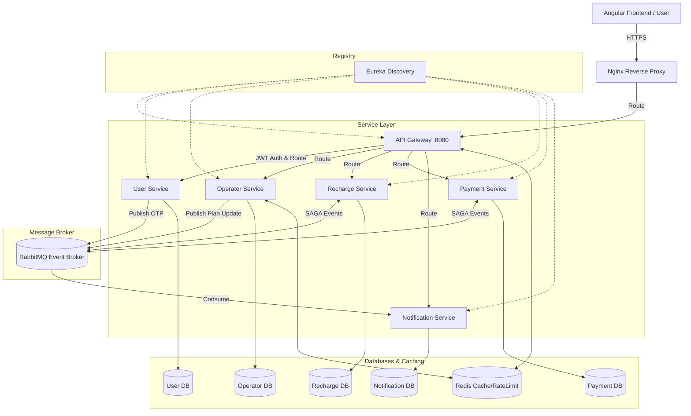
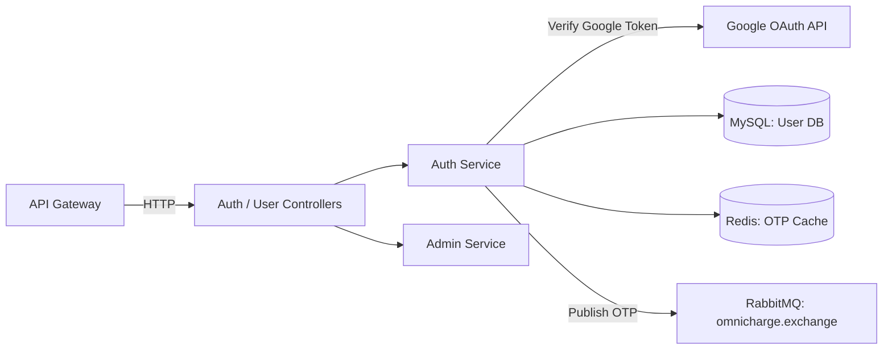
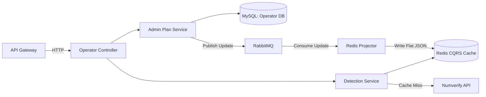
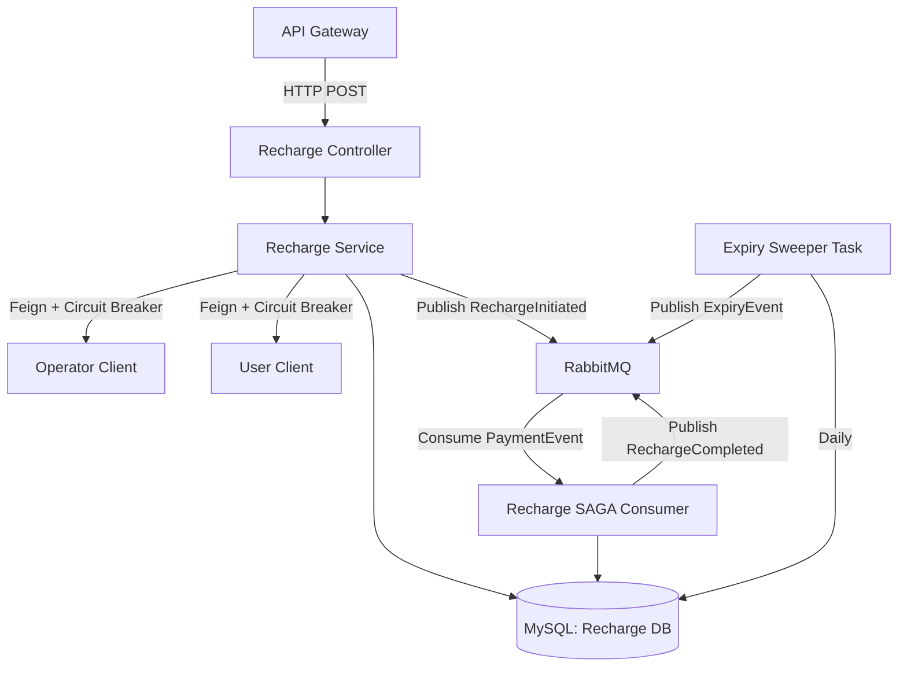
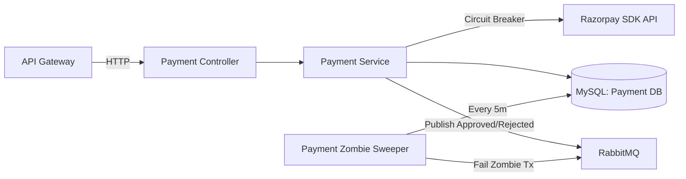
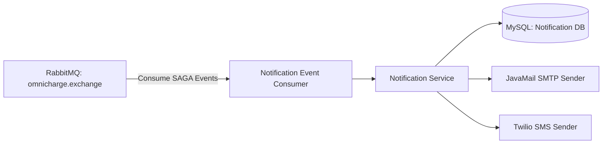
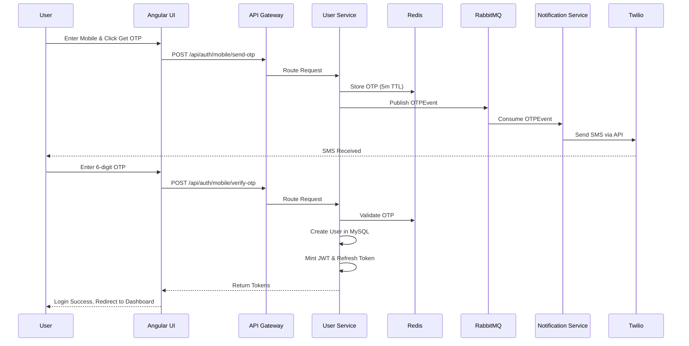
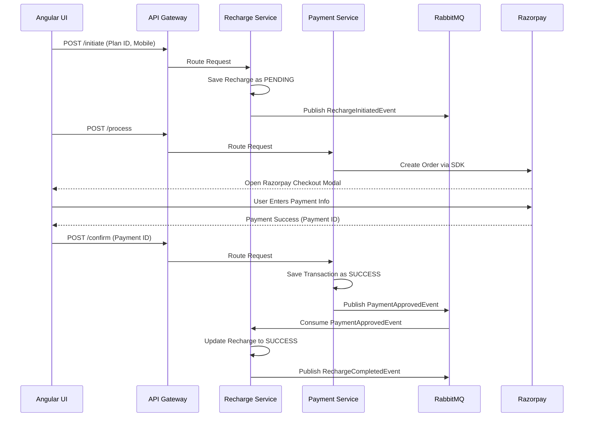
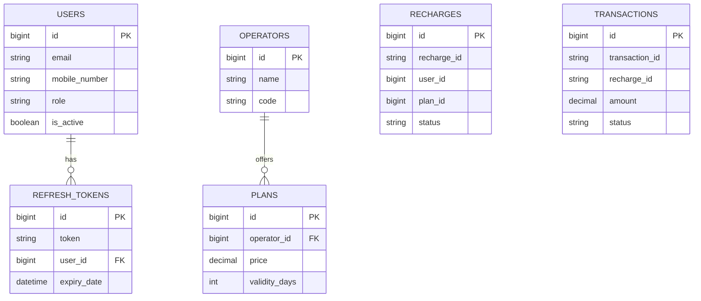

# OmniCharge Technical Documentation

## SECTION 1 — PROJECT OVERVIEW
OmniCharge is a highly scalable, distributed microservices-based mobile recharge platform. The system solves the problem of providing a seamless, highly available mobile recharge experience by orchestrating operator detection, plan selection, secure payment processing, and notification delivery. It serves two distinct user roles: end-users (who perform mobile recharges) and administrators (who manage operators, plans, user statuses, and view platform analytics).

The platform delivers the complete recharge lifecycle: mobile number input, Numverify API-based network operator detection, displaying operator-specific plans from a high-performance Redis read-model, checkout with authentication gates (mobile OTP or Google OAuth), secure Razorpay payment processing, and SAGA-orchestrated transaction fulfillment followed by instant SMS/email receipts. It also handles edge cases like abandoned Razorpay popups (zombie transactions) and plan expiry reminders.

**Executive Summary:** OmniCharge is a modern, enterprise-grade mobile recharge platform architected on Spring Boot 3.x microservices and Angular 17. By leveraging a reactive Spring Cloud Gateway, Netflix Eureka service mesh, RabbitMQ event-driven SAGA orchestration, CQRS for high-speed plan retrieval, and Resilience4j circuit breakers, the platform guarantees high availability, zero-data-loss logging via an Outbox Pattern, and strict fault tolerance. The system ensures robust data isolation using per-service MySQL schemas while offering real-time observability via Loki, Prometheus, Grafana, and Zipkin/Micrometer Tracing. The production system is deployed on an Azure VM utilizing Docker Compose with an Nginx reverse proxy for SSL termination.

**System Boundaries:** OmniCharge owns user identity, profile management, recharge orchestration, operator plan catalogs, and transaction history. It strictly delegates external capabilities: payment processing is delegated to Razorpay, mobile operator lookup is delegated to Numverify, SMS delivery is delegated to Twilio, email delivery is delegated to JavaMail/SMTP, and SSO is delegated to Google OAuth2.

---

## SECTION 2 — ARCHITECTURE DOCUMENT (HLD)
The OmniCharge backend is built as a distributed microservices ecosystem consisting of 9 discrete Spring Boot applications: `config-server`, `discovery-server`, `api-gateway`, `user-service`, `operator-service`, `recharge-service`, `payment-service`, `notification-service`, and `logging-service`.

**High-Level Architecture Diagram:**

**Why Microservices?** A microservices architecture was chosen over a monolith to enable independent scaling and fault isolation. For instance, the `operator-service` experiences heavy read traffic during plan browsing and scales independently using its Redis cache. The `payment-service` and `recharge-service` require strict transactional integrity but can fail independently without taking down the user profile system. Development agility is maintained by separating concerns (e.g., logging and notifications are decoupled via RabbitMQ).

**Communication Patterns:**
1. **Synchronous (Feign + Eureka):** Used when immediate consistency or read-before-write is needed. E.g., `recharge-service` uses `OperatorServiceClient` and `UserServiceClient` via OpenFeign to synchronously validate plans and users before initiating a recharge.
2. **Asynchronous (RabbitMQ Topic Exchange):** Used for non-blocking workflows. The `omnicharge.exchange` handles event-driven SAGA choreography (e.g., `PaymentApprovedEvent`). The `logging-service` uses a dedicated `omnicharge.logging.exchange` to absorb audit logs without blocking business logic.
3. **Reactive (WebFlux Gateway):** The `api-gateway` uses Spring WebFlux for non-blocking I/O routing, handling thousands of concurrent connections while validating JWTs in the `JwtAuthenticationFilter`.

**Service Mesh:** `discovery-server` (Netflix Eureka) acts as the service registry where all downstream services register. The `api-gateway` uses Eureka to route requests (e.g., `lb://user-service`). The `config-server` serves centralized properties from the local `config-repo/`, loaded at boot by all services via `spring.config.import`.

**Data Isolation Strategy:** OmniCharge strictly enforces database-per-service. There are 5 separate MySQL databases (`omnicharge_user_db`, `omnicharge_operator_db`, `omnicharge_recharge_db`, `omnicharge_payment_db`, `omnicharge_notification_db`). Cross-service joins do not exist; data aggregation happens in the frontend or via API composition.

**CQRS Implementation:** The `operator-service` uses CQRS. The write model persists `Operator` and `Plan` entities to MySQL. When a plan is updated, `OperatorEventPublisher.publishPlanUpdated()` sends a message to RabbitMQ. The `RedisProjector.consumePlanUpdatedEvent()` consumes this, bypasses MySQL, and builds a read-optimized JSON cache in Redis (`plans:operator:{id}`). The GET APIs read strictly from this Redis projection.

**SAGA Choreography Pattern:** 
1. `recharge-service` creates a `PENDING` recharge and publishes `RechargeInitiatedEvent`.
2. `payment-service` processes Razorpay payment. On success, publishes `PaymentApprovedEvent`. (If Razorpay modal is abandoned, `PaymentSweeperTask` publishes `PaymentRejectedEvent`).
3. `recharge-service` consumes `PaymentApprovedEvent` via `RechargeSagaConsumer.consumePaymentApproved()`, marks recharge `SUCCESS`, and publishes `RechargeCompletedEvent`.
4. `notification-service` consumes `RechargeCompletedEvent` and fires Twilio SMS and JavaMail emails.

**Outbox Pattern for Distributed Logging:** 
If RabbitMQ is down, `LogEventPublisher` fails. `FallbackLogWriter.writeToFallbackFile()` catches the exception and writes the log event to a local disk `.tmp` file in the `logs/` directory. On startup, `FallbackLogReplayer`'s `@PostConstruct` method starts a background daemon that reads these files, replays them to RabbitMQ, and deletes the files to guarantee zero log loss.

**Frontend Architecture:** Angular 17 is heavily utilized with a Signals-based state management approach (e.g., `activeCategory` in `recharge-flow.component.ts`). The app uses Standalone Components and lazy-loaded routes. The HTTP interceptor chain runs `httpCacheInterceptor` (for GET caching) -> `authInterceptor` (for JWT injection and 401 refresh queues) -> `errorInterceptor` (for global toast alerts).

---

## SECTION 3 — TECH STACK REFERENCE

| Technology | Version | Role in OmniCharge | Which services use it |
|---|---|---|---|
| Java | 17/21 | Core backend language | All microservices |
| Spring Boot | 3.5.11 | Core application framework | All microservices |
| Spring Cloud Gateway | 4.x | Reactive API Gateway, rate limiting | api-gateway |
| Netflix Eureka | 4.x | Service Discovery registry | discovery-server, all downstream |
| Spring Cloud Config | 4.x | Centralized configuration management | config-server, all downstream |
| RabbitMQ | 3.x | Message broker for SAGA & async events | All except config/discovery |
| Redis | 7.x | Token blacklist, operator CQRS read model, gateway rate limiting | api-gateway, operator-service |
| MySQL | 8.0 | Relational datastore (db-per-service) | user, operator, recharge, payment, notification |
| Resilience4j | 2.x | Circuit breaker, Retry for inter-service calls | recharge-service, payment-service |
| OpenFeign | 4.x | Declarative REST client | recharge-service |
| JJWT | 0.12.3 | JWT generation and validation | user-service, api-gateway |
| Razorpay SDK | 1.4.6 | Payment gateway integration | payment-service |
| Numverify API | v1 | Telecom network operator detection | operator-service |
| Google OAuth2 | 1.34.1 | Google Sign-in verification (`GoogleIdTokenVerifier`) | user-service |
| Twilio SDK | 10.x | SMS delivery | notification-service |
| JavaMail | Spring Mail | Email delivery via SMTP | notification-service |
| Promtail | 2.x | Log file collection & shipping | logging-service (Docker volumes) |
| Loki | 2.x | Lightweight log aggregation system | Observability Stack |
| Nginx | 1.18.x | Reverse proxy and SSL termination | Production VM |
| Prometheus | 2.x | Time-series metrics collection | All microservices via Actuator |
| Grafana | 10.x | Metrics visualization dashboard | Infrastructure |
| Micrometer / Zipkin | 1.12 | Distributed tracing (traceId/spanId) | All microservices |
| Angular | 17.x | Frontend SPA framework | omnicharge-ui |
| TypeScript | 5.4.x | Frontend language | omnicharge-ui |
| Tailwind CSS | 3.4.x | Utility-first CSS styling | omnicharge-ui |
| Lombok | 1.18.x | Boilerplate code reduction | All backend services |
| Docker Compose | v2 | Local container orchestration | Infrastructure |
| Maven | 3.9.x | Backend dependency management | All backend services |

---

## SECTION 4 — SERVICE-BY-SERVICE TECHNICAL REFERENCE

### 4.1 API Gateway
* **Identity Card:** Port: `8080`, DB: `Redis` (for rate limiting/blacklist), Spring App Name: `api-gateway`. Purpose: Central entry point, routes traffic, validates JWTs, applies CORS, and enforces rate limits. Dependencies: `config-server`, `discovery-server`, `redis`.
* **Key Classes:**
  * `GatewayConfig.java` (Config): Defines route locators (`route("user_service", r -> r.path("/api/users/**")...)`) and `RedisRateLimiter(2, 3, 1)`.
  * `CorsConfig.java` (Config): Configures `CorsWebFilter` and global `securityHeadersFilter` (XSS, Frame-Options).
  * `JwtAuthenticationFilter.java` (Filter): Extends `AbstractGatewayFilterFactory`, validates JJWT tokens, checks Redis blacklist `blacklist:{jti}`, populates `X-User-Id`, `X-User-Role`, `X-User-Email` headers.
  * `GlobalExceptionHandler.java` (Config): Maps WebFlux errors to uniform JSON `ApiResponse`.

### 4.2 Config Server
* **Identity Card:** Port: `8888`, DB: None, Spring App Name: `config-server`. Purpose: Serves centralized `.properties` files from the local filesystem (`config-repo/`). Dependencies: None.
* **Endpoints:** Exposes standard Spring Cloud Config endpoints (`/{application}/{profile}`).

### 4.3 Discovery Server (Eureka)
* **Identity Card:** Port: `8761`, DB: None, Spring App Name: `eureka-server`. Purpose: Netflix Eureka server for service registration and dynamic discovery. Dependencies: `config-server`.

### 4.4 User Service
* **Identity Card:** Port: `8081`, DB: `omnicharge_user_db`, Spring App Name: `user-service`. Purpose: Manages user identities, profiles, Google OAuth, OTP authentication, and token generation/refresh. Dependencies: `config-server`, `discovery-server`, `mysql`, `rabbitmq`.
* **Endpoints:**
  * `POST /api/auth/mobile/send-otp` (PUBLIC) - Send mobile OTP
  * `POST /api/auth/mobile/verify-otp` (PUBLIC) - Verify mobile OTP
  * `POST /api/auth/google` (PUBLIC) - Google SSO Login
  * `POST /api/auth/admin/login` (PUBLIC) - Admin credentials + 2FA login
  * `POST /api/auth/refresh-token` (PUBLIC) - Mint new access token from refresh token
  * `POST /api/auth/logout` (PROTECTED) - Blacklists token JTI in Redis
  * `GET /api/users/profile` (PROTECTED) - Get current user profile
  * `PUT /api/users/profile` (PROTECTED) - Update profile
  * `GET /api/admin/users` (PROTECTED: ADMIN) - Paged list of all users
* **Key Classes:**
  * `AuthService.java` (Service): Handles OTP generation, Google token verification via `GoogleIdTokenVerifier`, and mints JWTs using `JwtUtil`.
  * `RefreshTokenService.java` (Service): Manages MySQL storage of refresh tokens, enforces `MAX_DEVICES = 4`.
  * `AdminService.java` (Service): Handles admin user fetching and status toggling.
  * `GatewayAuthenticationFilter.java` (Filter): `OncePerRequestFilter` that intercepts headers injected by API Gateway to populate `SecurityContextHolder`.
* **Data Model:**
  * `User` (table `users`): `id` (PK), `email` (Unique), `mobileNumber` (Unique), `passwordHash`, `role` (Enum), `isActive`, `isMobileVerified`.
  * `RefreshToken` (table `refresh_tokens`): `id` (PK), `token` (Unique), `userId` (FK), `expiryDate`, `deviceInfo`.
* **Events Published:** `OTPEvent` -> `omnicharge.exchange` (routing key: `notification.otp`), `LogEvent` -> `omnicharge.logging.exchange`.
* **Internal Component Diagram:**

### 4.5 Operator Service
* **Identity Card:** Port: `8082`, DB: `omnicharge_operator_db`, `Redis` (CQRS read model), Spring App Name: `operator-service`. Purpose: Manages telecom operators, recharge plans, and executes Numverify detection. Dependencies: `config-server`, `discovery-server`, `mysql`, `redis`, `rabbitmq`.
* **Endpoints:**
  * `GET /api/operators` (PUBLIC) - List active operators
  * `GET /api/operators/detect/{mobileNumber}` (PUBLIC) - Detect network via Numverify
  * `GET /api/operators/{operatorId}/plans` (PUBLIC) - Read plans from Redis CQRS
  * `GET /api/operators/plans/{planId}` (PUBLIC) - Read single plan from Redis
  * `PUT /api/admin/plans/{planId}` (PROTECTED: ADMIN) - Update plan details
* **Key Classes:**
  * `OperatorDetectionService.java` (Service): Checks Redis cache for mobile prefixes, calls Numverify if miss.
  * `RedisProjector.java` (Consumer): Listens to RabbitMQ plan updates to rebuild Redis JSON cache.
  * `SystemCacheService.java` (Service): Boots up caching, cold-starts Redis on application start if empty.
  * `OperatorEventPublisher.java` (Producer): Emits `PlanUpdatedMessage`.
* **Data Model:**
  * `Operator` (table `operators`): `id` (PK), `name`, `code`, `type`, `isActive`. OneToMany with `Plan`.
  * `Plan` (table `plans`): `id` (PK), `operator_id` (FK), `planName`, `price`, `validityDays`, `dataLimit`, `category`, `isActive`.
* **Events Published:** `PlanUpdatedMessage` -> `omnicharge.exchange` (routing key: `operator.plan.updated`).
* **Events Consumed:** `PlanUpdatedMessage` queue -> updates Redis projection.
* **Redis Keys:** `plans:operator:{id}`, `plan:detail:{id}`, `operator:detect:{mobile}`.
* **Internal Component Diagram:**

### 4.6 Recharge Service
* **Identity Card:** Port: `8083`, DB: `omnicharge_recharge_db`, Spring App Name: `recharge-service`. Purpose: Core orchestrator for the recharge lifecycle, validates dependencies, acts as SAGA coordinator, and manages plan expiry schedules. Dependencies: `config-server`, `discovery-server`, `mysql`, `rabbitmq`.
* **Endpoints:**
  * `POST /api/recharges/initiate` (PROTECTED: PROFILE_COMPLETE) - Start SAGA flow
  * `GET /api/recharges/history` (PROTECTED) - User's recharge history
  * `GET /api/admin/recharges` (PROTECTED: ADMIN) - Global recharge viewing
  * `GET /api/recharges/expiring` (PROTECTED) - Get recharges expiring in N days
* **Key Classes:**
  * `RechargeService.java` (Service): Implements `initiateRecharge()`. Uses OpenFeign (`OperatorServiceClient`, `UserServiceClient`) wrapped in Resilience4j `@CircuitBreaker` to validate data.
  * `RechargeSagaConsumer.java` (Consumer): Listens for `PaymentApprovedEvent` and `PaymentRejectedEvent` to transition Recharge statuses.
  * `RechargeExpirySweeperTask.java` (Scheduler): `@Scheduled` task that runs daily to mark recharges as EXPIRED and trigger notifications.
* **Data Model:**
  * `Recharge` (table `recharges`): `id` (PK), `rechargeId` (Unique), `userId`, `planId`, `mobileNumber`, `amount`, `status` (Enum: PENDING, SUCCESS, FAILED, EXPIRED), `planExpiryDate`.
* **Events Published:** `RechargeInitiatedEvent`, `RechargeCompletedEvent`, `PlanExpiryEvent`.
* **Events Consumed:** `PaymentApprovedEvent`, `PaymentRejectedEvent`.
* **Resilience Config:** Uses annotations `@CircuitBreaker(name = "operatorService", fallbackMethod = "fallbackOperatorDetails")`. Properties defined in config-repo (e.g. failureRateThreshold=50).
* **Internal Component Diagram:**

### 4.7 Payment Service
* **Identity Card:** Port: `8084`, DB: `omnicharge_payment_db`, Spring App Name: `payment-service`. Purpose: Handles financial transactions and Razorpay gateway integration. Dependencies: `config-server`, `discovery-server`, `mysql`, `rabbitmq`.
* **Endpoints:**
  * `POST /api/payments/process` (PROTECTED) - Create transaction and Razorpay order
  * `POST /api/payments/confirm` (PROTECTED) - Webhook confirm payment
  * `POST /api/payments/fail` (PROTECTED) - Frontend triggered SAGA rollback
  * `GET /api/admin/payments` (PROTECTED: ADMIN) - View global transactions
* **Key Classes:**
  * `PaymentService.java` (Service): Central logic. Contains safe `PaymentMethod.valueOf()` fallback to `UNKNOWN`.
  * `RazorpayPaymentService.java` (Service): Wraps Razorpay SDK calls in Resilience4j `@CircuitBreaker(name = "razorpayService")`.
  * `PaymentSweeperTask.java` (Scheduler): Runs every 5 minutes. Finds PENDING transactions > 15 mins, marks FAILED, fires `PaymentRejectedEvent`.
* **Data Model:**
  * `Transaction` (table `transactions`): `id` (PK), `transactionId`, `rechargeId`, `userId`, `amount`, `paymentMethod` (Enum: CREDIT_CARD, DEBIT_CARD, CARD, UPI, NET_BANKING, WALLET, RAZORPAY, UNKNOWN), `status` (Enum), `razorpayOrderId`, `razorpayPaymentId`.
* **Events Published:** `PaymentApprovedEvent`, `PaymentRejectedEvent`, `PaymentCompletedEvent`.
* **Internal Component Diagram:**

### 4.8 Notification Service
* **Identity Card:** Port: `8085`, DB: `omnicharge_notification_db`, Spring App Name: `notification-service`. Purpose: Asynchronous delivery of SMS (Twilio) and Emails (JavaMail). Dependencies: `config-server`, `discovery-server`, `mysql`, `rabbitmq`.
* **Endpoints:**
  * `GET /api/notifications` (PROTECTED) - User notification inbox
  * `PUT /api/notifications/{id}/read` (PROTECTED) - Mark as read
* **Key Classes:**
  * `NotificationEventConsumer.java` (Consumer): Listens to OTP, Payment, Recharge, and Expiry events.
  * `EmailService.java` (Service): Sends HTML and plain text emails via SMTP.
  * `SmsService.java` (Service): Connects to Twilio API.
* **Data Model:**
  * `Notification` (table `notifications`): `id` (PK), `userId`, `type` (Enum: SMS, EMAIL, IN_APP), `category` (Enum: OTP, PAYMENT, RECHARGE, EXPIRY), `title`, `message`, `isRead`.
* **Internal Component Diagram:**

### 4.9 Logging Service
* **Identity Card:** Port: `8086`, DB: None (uses ELK stack log files), Spring App Name: `logging-service`. Purpose: Centralized audit logging absorber. Listens to `omnicharge.logging.exchange`. Dependencies: `config-server`, `discovery-server`, `rabbitmq`.
* **Key Classes:**
  * `LogEventConsumer.java` (Consumer): Reads `LogEvent` JSON objects and outputs them using SLF4J to log files formatted as Logstash JSON encoders.

---

## SECTION 5 — SECURITY ARCHITECTURE

**Two-Layer Security Model:** 
1. The **API Gateway** acts as the first line of defense. The `JwtAuthenticationFilter` intercepts requests, parses the JJWT token, validates the signature, and checks Redis to ensure the token's JTI is not in the `blacklist:{jti}`. If valid, it strips the Authorization header and injects `X-User-Id`, `X-User-Role`, and `X-User-Email` HTTP headers.
2. The **Downstream Services** use `GatewayAuthenticationFilter` (a Spring Security `OncePerRequestFilter`). This filter reads the injected `X-User-*` headers, trusts them implicitly (since the Gateway is the only public ingress), and populates the `SecurityContextHolder` with a `UsernamePasswordAuthenticationToken`.

**Authentication Modes:**
1. **Mobile OTP:** `sendPublicMobileOtp()` fires RabbitMQ event to Twilio. `verifyMobileOtp()` checks Redis OTP store.
2. **Email OTP:** Uses same flow but sends via JavaMail.
3. **Admin Password + 2FA:** Checks BCrypt password hash, then requires OTP validation.
4. **Google OAuth:** Uses `GoogleIdTokenVerifier` to cryptographically verify Google JWTs. Auto-creates user if email doesn't exist.

**JWT Structure:** Generated using JJWT `Jwts.builder()`. Signed with HMAC SHA-256 (`Keys.hmacShaKeyFor(secret.getBytes())`). Expiry is 1 hour. Claims stored: `userId`, `role`, `email`, `isProfileComplete`, `isMobileVerified`. A unique UUID `jti` is included for revocation.

**Refresh Token Mechanism:** Stored in MySQL `refresh_tokens`. When a user requests a refresh, the system verifies the old token, issues a new JWT and a new refresh token (rotation). To prevent infinite sessions, a device limit is enforced: `MAX_DEVICES = 4`. If a 5th login occurs, the oldest refresh token for that user is deleted.

**Token Blacklisting:** On `/api/auth/logout`, the `jti` claim is extracted. The Gateway stores `blacklist:{jti}` in Redis with a TTL equal to the remaining valid duration of the JWT.

**Method Security:** Downstream controllers use `@PreAuthorize("hasRole('ADMIN')")` enabled by `@EnableMethodSecurity`.

**Profile Completeness Gate:** Operations like `/api/recharges/initiate` check the `isProfileComplete` claim. If false, Gateway returns 403. Users must complete `/api/users/profile` first.

**CORS Configuration:** `CorsConfig.java` in Gateway only allows explicit origins (no `*`). Methods: GET, POST, PUT, DELETE, OPTIONS, PATCH. Exposed headers: `Authorization`. Allow Credentials: true. X-Content-Type-Options: nosniff, X-Frame-Options: DENY, X-XSS-Protection: 1; mode=block.

**Rate Limiting:** `RedisRateLimiter(2, 3, 1)` in GatewayConfig. 
- `replenishRate = 2` (requests per second allowed).
- `burstCapacity = 3` (max burst allowed in a single second).
- `requestedTokens = 1` (tokens consumed per request).
The KeyResolver uses the remote IP address.

**Public Paths (No Auth Required):** `/api/auth/**`, `/api/operators/**`, `/actuator/**`, `/swagger-ui/**`, `/v3/api-docs/**`. All others are PROTECTED.

---

## SECTION 6 — DATA FLOW DOCUMENTATION

**Flow 1 — New User Mobile OTP Registration and Login:**

1. Angular `LoginComponent` calls `AuthService.sendPublicMobileOtp()`.
2. API Gateway routes to `user-service` `AuthController.sendMobileOtp()`.
3. `AuthService.java` generates 6-digit OTP, stores in Redis (`otp:mobile:{number}`) with 5min TTL.
4. Emits `OTPEvent` via RabbitMQ. `notification-service` consumes and sends SMS via Twilio.
5. User enters OTP. Angular calls `AuthService.verifyMobileOtp()`.
6. Gateway routes to `AuthController.verifyMobileOtp()`.
7. `AuthService` verifies against Redis, creates `User` in MySQL.
8. `JwtUtil.generateAccessToken()` mints JWT and `RefreshTokenService` stores refresh token in MySQL.
9. Angular intercepts response, stores tokens in `localStorage`, calls `restoreSession()` to set Signals.

**Flow 2 — Complete Recharge with Razorpay (SAGA Orchestration):**

1. Angular `RechargeFlowComponent.onMobileInput()` triggers `OperatorService.detectOperator()`.
2. `operator-service` checks Redis `operator:detect:{mobile}`. If miss, calls Numverify API.
3. Plans loaded from CQRS Redis `plans:operator:{id}`. User selects plan and hits `onProceedToCheckout()`.
4. Angular checks auth gate (login/verify required).
5. Calls `RechargeService.initiateRecharge()`. Gateway routes to `recharge-service`.
6. `RechargeService.java` uses `OperatorServiceClient` (Feign, with caching & Retry) to validate plan, and `UserServiceClient` (Feign, Circuit Breaker) to validate user.
7. Saves `Recharge` to MySQL (PENDING).
8. SAGA Step 1: Publishes `RechargeInitiatedEvent` to RabbitMQ.
9. Angular calls `PaymentService.processPayment()`. Gateway routes to `payment-service`.
10. `PaymentService.processPayment()` calls `RazorpayPaymentService` to create Razorpay Order.
11. Angular opens Razorpay checkout popup. User pays.
12. Razorpay returns success handler. Angular calls `PaymentService.confirmPayment()`.
13. `payment-service` updates `Transaction` to SUCCESS, publishes `PaymentApprovedEvent`.
14. `recharge-service` `RechargeSagaConsumer` consumes event, marks `Recharge` SUCCESS, publishes `RechargeCompletedEvent`.
15. `notification-service` consumes event, sends JavaMail email and Twilio SMS. `logging-service` persists audit trails.

**Flow 3 — Plan Expiry Lifecycle:**
1. Daily at midnight, `recharge-service` runs `RechargeExpirySweeperTask.sweepExpiredRecharges()`.
2. Finds `Recharge` records where `status = SUCCESS` and `planExpiryDate < now()`.
3. Updates status to `EXPIRED`.
4. Publishes `PlanExpiryEvent`. `notification-service` consumes and sends instant SMS/Email.
5. Separately, Angular Dashboard calls `/api/recharges/expiring?daysLeft=5`.
6. `recharge-service` returns list. Angular Signal triggers `showReminderModal`, redirecting user to `/recharge?mobile=X`.

**Flow 4 — Admin Plan Update with Redis Cache Invalidation:**
1. Admin uses UI to edit plan. Angular calls PUT `/api/admin/plans/{id}`.
2. Gateway routes to `operator-service` `AdminOperatorController`. Method is `@PreAuthorize("hasRole('ADMIN')")`.
3. `OperatorService.updatePlan()` saves to MySQL.
4. Calls `OperatorEventPublisher.publishPlanUpdated()`. RabbitMQ routes to `operator.plan.updated`.
5. `RedisProjector.consumePlanUpdatedEvent()` receives message. Checks Redis for `event:processed:{id}` to deduplicate.
6. Queries fresh DB data, writes JSON to `plans:operator:{id}` and `plan:detail:{id}`. Deletes `operator:detect:*` cache to ensure new mapping.

**Flow 5 — Token Refresh on 401:**
1. Access token expires. Angular makes API call.
2. API Gateway returns 401 Unauthorized.
3. Angular `authInterceptor` catches 401. Sets `isRefreshing = true`.
4. Puts failed request into a `BehaviorSubject` queue.
5. Calls POST `/api/auth/refresh-token` with stored refresh token.
6. `user-service` returns new tokens.
7. Interceptor saves new tokens, replays all queued requests with new Authorization header.
8. If refresh fails (e.g. refresh token expired), `authService.logout()` is called, clearing `localStorage` and routing to `/login?returnUrl=`.

**Flow 6 — Fallback Log Replay (Outbox Pattern):**
1. Backend service attempts to log audit event. RabbitMQ is down.
2. `LogEventPublisher.publish()` throws `AmqpException`.
3. `catch` block calls `FallbackLogWriter.writeToFallbackFile()`. Event is serialized to JSON and appended to `.tmp` file in `/logs` directory.
4. RabbitMQ recovers.
5. Spring Boot `FallbackLogReplayer` bean runs `@PostConstruct` logic: starts a daemon thread that wakes up every 30s.
6. Daemon finds `.tmp` files, reads lines, successfully publishes to RabbitMQ via `RabbitTemplate`, and deletes the `.tmp` file.
7. `@PreDestroy` ensures daemon shuts down gracefully.

---

## SECTION 7 — FRONTEND DOCUMENTATION

### 7.1 Application Architecture
Angular 17 relies heavily on **Signals** for synchronous, reactive state management without RxJS boilerplate. 
- `AuthService` manages `currentUser`, `isAuthenticated`, `isMobileVerified` Signals.
- `OperatorService` manages `operators`, `plans`, `selectedOperator` Signals.
- The app uses **Standalone Components** configured in `app.routes.ts` via `loadComponent` for lazy loading modules.
- **Interceptor Chain:**
  1. `httpCacheInterceptor`: Intercepts GET requests, checks `Map` cache. Bypassed if `Cache-Control: no-cache` is present.
  2. `authInterceptor`: Injects `Bearer` token. Handles 401 queueing and refresh token logic.
  3. `errorInterceptor`: Catches global HttpErrors, displays Toast notifications (e.g., 500 triggers "Server error").

### 7.2 Service Reference

| Angular Service | Key Methods | HTTP Call | Auth Required | Signals Managed |
|---|---|---|---|---|
| `AuthService` | `sendPublicMobileOtp()`, `verifyMobileOtp()`, `loginWithGoogle()`, `logout()` | `POST /api/auth/*` | No (except logout) | `currentUser`, `isAuthenticated` |
| `OperatorService` | `loadActiveOperators()`, `detectOperator(mobile)`, `loadPlans(opId)` | `GET /api/operators/*` | No | `operators`, `selectedOperator`, `plans` |
| `RechargeService` | `initiateRecharge()`, `getHistory()`, `getExpiringRecharges(days)` | `POST / GET /api/recharges/*` | Yes | `rechargeHistory`, `expiringRecharges` |
| `PaymentService` | `processPayment()`, `confirmPayment()`, `failPayment()`, `verifyPayment()` | `POST /api/payments/*` | Yes | `paymentState`, `currentTransaction` |
| `NotificationService`| `getNotifications()`, `markAsRead(id)`, `getUnreadCount()` | `GET / PUT /api/notifications/*`| Yes | `notifications`, `unreadCount` |

### 7.3 Component Reference

| Component | Route | Key Interactions | Dependencies | Guards |
|---|---|---|---|---|
| `LoginComponent` | `/login` | Mobile input `(input)`, OTP verify `(click)`, Google Sign-In | `AuthService`, `Router` | `GuestGuard` |
| `RechargeFlowComponent`| `/recharge` | Mobile detect `(input)`, Plan selection `(click)`, Razorpay modal | `OperatorService`, `RechargeService`, `PaymentService`, `AuthService` | None (Auth handled in component) |
| `DashboardComponent` | `/dashboard` | View history, Quick recharge, Pay expiring | `RechargeService`, `AuthService` | `AuthGuard` |
| `AdminTransactionsComponent` | `/admin/transactions` | Date filtering `(change)`, Status filter tabs | `AdminService` | `AdminGuard` |

### 7.4 Route & Guard Reference

| Route | Component | Guard | Lazy Loaded | Notes |
|---|---|---|---|---|
| `/` | `LandingComponent` | None | Yes | Landing page marketing |
| `/login` | `LoginComponent` | `GuestGuard` | Yes | Redirects to `/dashboard` if logged in |
| `/recharge` | `RechargeFlowComponent`| None | Yes | Primary business flow |
| `/dashboard` | `DashboardComponent` | `AuthGuard` | Yes | User profile and history |
| `/admin/*` | Multiple | `AdminGuard` | Yes | Validates `role === 'ROLE_ADMIN'` |

### 7.5 Environment Configuration
The Angular `environment.ts` provides variables loaded into services via `environment.apiBaseUrl` (e.g., `http://localhost:8080`) and `environment.googleClientId`.

---

## SECTION 8 — INFRASTRUCTURE & DEPLOYMENT

### 8.1 Production Deployment (Azure VM)
The production environment runs on a self-managed Azure VM (`Standard_B2s`, Ubuntu 22.04) using `docker-compose.prod.yml`.
- **Reverse Proxy**: Nginx handles SSL termination (Let's Encrypt / Certbot) and proxies external traffic (`omnicharge.centralindia...`) to the internal API Gateway.
- **Frontend**: Hosted on GitHub Pages (`vishnuvardhanreddythornala.github.io/OmniCharge/`), utilizing `environment.production.ts` to point strictly to the VM's HTTPS domain.
- **Backend Orchestration**:
  - `mysql`: Image `mysql:8.0.35`, private network.
  - `redis`: Image `redis:7.2.4-alpine`, private network.
  - `rabbitmq`: Exposed via `0.0.0.0:15672` for management.
  - Microservices (Gateway, User, Payment, etc.) are built via GitHub Actions and pulled from Docker Hub.
- **Observability**: `zipkin` (Port `9411`), `prometheus` (Port `9090`), `loki` (Port `3100`), `promtail`, and `grafana` (Port `3000`) are orchestrated alongside the services to provide a lightweight, sub-1GB memory footprint alternative to ELK.

### 8.2 Config Server Properties Reference
In `config-repo/*.properties`:
- **DB Configuration:** `spring.datasource.url=jdbc:mysql://mysql:3306/omnicharge_xxx_db`
- **JPA:** `spring.jpa.hibernate.ddl-auto=update`
- **RabbitMQ:** `spring.rabbitmq.host=rabbitmq`, `spring.rabbitmq.port=5672`
- **Resilience4j:** Thresholds defined per instance (e.g., `resilience4j.circuitbreaker.instances.operatorService.failureRateThreshold=50`).
- **Eureka:** `eureka.client.service-url.defaultZone=${EUREKA_SERVER_URL}`

### 8.3 Service Startup Order
Strict dependency chain enforced via Docker Compose `depends_on`:
1. `rabbitmq`, `mysql`, `redis` (Infrastructure)
2. `config-server` (Requires infra, serves config to all)
3. `eureka-server` (Requires config-server)
4. `api-gateway` & All Business Services (Require eureka-server and config-server).

### 8.4 Observability Stack
- **Prometheus:** Services expose `/actuator/prometheus`. Scraped by Prometheus server.
- **Grafana:** Visualizes metrics like API latency, JVM heap usage, Circuit Breaker states (`resilience4j_circuitbreaker_state`).
- **Zipkin / Micrometer Tracing:** Injects `traceId` and `spanId` into log formats. Traces requests from Gateway down to DB.
- **Loki + Promtail:** Logs generated by `logging-service` are ingested by Promtail, shipped to Loki, and visualized natively in Grafana (Explore view). This replaces the heavier ELK stack.
- **Health Endpoints:** `management.endpoint.health.show-details=always` is enabled globally. Exposes DB, RabbitMQ, DiskSpace, and Circuit Breaker health.

---

## SECTION 9 — RESILIENCE & FAULT TOLERANCE REFERENCE

| Service | Protection Target | Mechanism | Config Values (from properties) | Fallback Behavior |
|---|---|---|---|---|
| `recharge-service` | `OperatorServiceClient` | Circuit Breaker | slidingWindow=10, minCalls=5, wait=5s, failRate=50%, recordExceptions=IOException,TimeoutException | `fallbackOperatorDetails()` returns dummy Operator data |
| `recharge-service` | `UserServiceClient` | Circuit Breaker | slidingWindow=10, minCalls=5, wait=30s, failRate=50% | `fallbackUserValidation()` returns error response |
| `recharge-service` | `OperatorServiceClient` | Retry | maxAttempts=3, wait=1s, exponentialBackoff=true, multiplier=2 | Executes API call up to 3 times before opening circuit |
| `payment-service` | `RazorpayPaymentService`| Circuit Breaker | slidingWindow=10, minCalls=5, wait=30s, failRate=50%, slowCallRate=100%, slowDuration=5s | Fails payment gracefully without blocking threads |
| `operator-service` | `Redis` cache | Circuit Breaker | slidingWindow=10, minCalls=5, wait=5s, failRate=50% | Falls back to database query if Redis goes down |
| `All Services` | `LogEventPublisher` | Outbox Pattern | N/A | `FallbackLogWriter` writes to local `.tmp` file |
| `logging-service`| `.tmp` Outbox files | Replay Scheduler | Delay=30s | `FallbackLogReplayer` reads `.tmp` and pushes to RabbitMQ |
| `payment-service` | Razorpay Abandonment | Zombie Sweeper | FixedRate=5min, Timeout=15min | `PaymentSweeperTask` marks PENDING as FAILED, fires SAGA event |
| `recharge-service` | Plan Expiry | Expiry Sweeper | Cron (Midnight) | `RechargeExpirySweeperTask` marks SUCCESS as EXPIRED |

---

## SECTION 10 — EVENT CATALOG (Complete RabbitMQ Reference)

| Event Class | Publisher Service | Exchange | Routing Key | Consumer Service | Consumer Queue | Consumer Method | Payload Summary |
|---|---|---|---|---|---|---|---|
| `RechargeInitiatedEvent` | recharge | omnicharge.exchange | saga.recharge.initiated | payment | saga-payment-queue | `PaymentSagaConsumer.consumeRechargeInitiated` | rechargeId, amount, userId |
| `PaymentApprovedEvent` | payment | omnicharge.exchange | saga.payment.approved | recharge | saga-recharge-queue | `RechargeSagaConsumer.consumePaymentApproved` | rechargeId, transactionId |
| `PaymentRejectedEvent` | payment | omnicharge.exchange | saga.payment.rejected | recharge | saga-recharge-queue | `RechargeSagaConsumer.consumePaymentRejected` | rechargeId, failureReason |
| `PaymentCompletedEvent` | payment | omnicharge.exchange | notification.payment | notification | notification-payment-queue | `NotificationEventConsumer.consumePaymentEvent` | amount, status, userEmail |
| `RechargeCompletedEvent`| recharge | omnicharge.exchange | notification.recharge | notification | notification-recharge-queue | `NotificationEventConsumer.consumeRechargeEvent`| rechargeId, planName, status |
| `PlanUpdatedMessage` | operator | omnicharge.exchange | operator.plan.updated | operator | operator-plan-queue | `RedisProjector.consumePlanUpdatedEvent` | operatorId, eventId |
| `OTPEvent` | user | omnicharge.exchange | notification.otp | notification | notification-otp-queue | `NotificationEventConsumer.consumeOtpEvent` | otp, mobileNumber, email |
| `PlanExpiryEvent` | recharge | omnicharge.exchange | notification.expiry | notification | notification-expiry-queue | `NotificationEventConsumer.consumeExpiryEvent` | rechargeId, planName |
| `LogEvent` | All Services | omnicharge.logging.exchange | system.log.* | logging | system-log-queue | `LogEventConsumer.consumeLogEvent` | serviceName, eventType, context |

---

## SECTION 11 — LOW-LEVEL DESIGN (LLD) & DATABASE SCHEMA REFERENCE

**Entity Relationship Diagram (ERD):**

**1. omnicharge_user_db**
- `users`: `id` (BIGINT, PK, AutoInc), `email` (VARCHAR(100), UNIQUE), `mobile_number` (VARCHAR(20), UNIQUE), `password_hash` (VARCHAR(255)), `role` (VARCHAR(20) ENUM), `is_active` (BIT), `is_mobile_verified` (BIT), `full_name` (VARCHAR(100)). Maps to `User.java`.
- `refresh_tokens`: `id` (BIGINT, PK), `token` (VARCHAR(255), UNIQUE), `user_id` (BIGINT, FK->users), `expiry_date` (DATETIME), `device_info` (VARCHAR(255)). Maps to `RefreshToken.java`.

**2. omnicharge_operator_db**
- `operators`: `id` (BIGINT, PK), `name` (VARCHAR(100)), `code` (VARCHAR(50), UNIQUE), `type` (VARCHAR(50)), `description` (VARCHAR(500)), `is_active` (BIT). Maps to `Operator.java`.
- `plans`: `id` (BIGINT, PK), `operator_id` (BIGINT, FK->operators), `plan_name` (VARCHAR(100)), `price` (DECIMAL), `validity_days` (INT), `data_limit` (VARCHAR(50)), `category` (VARCHAR(50)), `is_active` (BIT). Maps to `Plan.java`.

**3. omnicharge_recharge_db**
- `recharges`: `id` (BIGINT, PK), `recharge_id` (VARCHAR(50), UNIQUE), `user_id` (BIGINT), `plan_id` (BIGINT), `mobile_number` (VARCHAR(20)), `amount` (DECIMAL), `status` (VARCHAR(50) ENUM), `plan_expiry_date` (DATETIME), `operator_name` (VARCHAR), `plan_name` (VARCHAR). Maps to `Recharge.java`.

**4. omnicharge_payment_db**
- `transactions`: `id` (BIGINT, PK), `transaction_id` (VARCHAR(50), UNIQUE), `recharge_id` (VARCHAR(50)), `user_id` (BIGINT), `amount` (DECIMAL), `payment_method` (VARCHAR(50) ENUM: CREDIT_CARD, DEBIT_CARD, CARD, UPI, NET_BANKING, WALLET, RAZORPAY, UNKNOWN), `status` (VARCHAR(50) ENUM), `failure_reason` (VARCHAR(500)), `razorpay_order_id` (VARCHAR, UNIQUE), `razorpay_payment_id` (VARCHAR). Maps to `Transaction.java`.

**5. omnicharge_notification_db**
- `notifications`: `id` (BIGINT, PK), `user_id` (BIGINT), `type` (VARCHAR(50) ENUM), `category` (VARCHAR(50) ENUM), `title` (VARCHAR(255)), `message` (TEXT), `is_read` (BIT), `created_date` (DATETIME). Maps to `Notification.java`.

---

## SECTION 12 — KNOWN DESIGN DECISIONS & ARCHITECTURAL RATIONALE

- **ReactiveRedisTemplate in Gateway vs Blocking RedisTemplate in Downstream:** The API Gateway is built on Spring WebFlux (Project Reactor), which utilizes a small number of event loop threads. Using blocking I/O (like standard `RedisTemplate`) would cause thread starvation and crash the gateway under load. Downstream services use Spring WebMVC (Servlet API), which is thread-per-request, making blocking `RedisTemplate` safe and simpler to code.
- **feign.circuitbreaker.enabled=false in Recharge Service:** It is set to `false` because OmniCharge uses the Resilience4j Spring Boot 3 starter with manual `@CircuitBreaker` annotations on service methods rather than wrapping the Feign interfaces at the Spring Cloud OpenFeign layer. This provides finer-grained control over fallbacks.
- **PaymentSagaConsumer does nothing on RechargeInitiatedEvent:** As noted in the architectural comments, the `payment-service` intentionally does not auto-deduct funds when `RechargeInitiatedEvent` arrives. OmniCharge uses a synchronous payment trigger via Razorpay's frontend SDK. The event is just an audit marker.
- **ignoreExceptions=BadRequestException for UserServiceClient:** Configured to prevent 400 Bad Request responses (e.g., "User not found") from counting towards the Circuit Breaker failure rate. Circuit breakers should only open for systemic infrastructure failures (500s, timeouts), not expected business validation logic errors.
- **isolation = READ_COMMITTED on RedisProjector:** Ensures the projector only reads fully committed `Operator` and `Plan` data from MySQL when rebuilding the Redis JSON cache, preventing dirty reads of partial admin updates.
- **omnicharge.logging.exchange Dedicated Exchange:** Logging creates massive message volume. Putting `LogEvent`s on the main SAGA exchange (`omnicharge.exchange`) could cause Head-of-Line blocking and delay critical transactional events (like `PaymentApprovedEvent`).
- **Ordered with getOrder() = -1 on JwtAuthenticationFilter:** Ensures the custom JWT filter executes *before* Spring Cloud Gateway's default routing filters, allowing it to mutate the request headers (`X-User-Id`) before the request is forwarded downstream.
- **OncePerRequestFilter for GatewayAuthenticationFilter:** Ensures the filter executes exactly once per HTTP request lifecycle, preventing duplicate `SecurityContext` populations during internal Spring MVC forwards.
- **Event-driven invalidation for Plan Cache:** `OperatorService` uses `RedisProjector` to manually rebuild Redis keys on `PlanUpdatedMessage` rather than relying on TTLs. This guarantees users always see real-time price updates immediately after an admin changes them.
- **MAX_DEVICES = 4 for Refresh Tokens:** Prevents database bloat and mitigates session hijacking by automatically purging the oldest `RefreshToken` record when a user logs in on a 5th concurrent browser/device.

---

## SECTION 13 — ERROR HANDLING REFERENCE

- **@ControllerAdvice / @ExceptionHandler:** Implemented globally in each service (e.g., `GlobalExceptionHandler.java`). 
  - `ResourceNotFoundException` -> HTTP 404
  - `BadRequestException` -> HTTP 400
  - `MethodArgumentNotValidException` -> HTTP 400 (validation errors)
  - `Exception` -> HTTP 500
- **Frontend errorInterceptor:**
  - `401 Unauthorized`: Triggers token refresh queue.
  - `403 Forbidden`: Redirects to `/dashboard` or shows "Access Denied" toast.
  - `404 Not Found`: Shows "Resource not found" toast.
  - `5xx Server Error`: Shows "Something went wrong on our server" toast.
- **Circuit Breaker Fallbacks:** E.g., `fallbackOperatorDetails()` in `RechargeService` catches `CallNotPermittedException` and returns a dummy `OperatorResponse` with `ApiResponse.error("Operator service temporarily unavailable")`.
- **FallbackLogWriter Failure:** If writing to the `.tmp` file also fails (e.g., full disk), the exception is logged to standard output (`e.printStackTrace()`), but it does not throw upward to ensure the main business thread is never killed by a logging failure.
- **RabbitMQ Message Rejection:** By default, if a `@RabbitListener` throws an exception, Spring AMQP automatically requeues the message indefinitely unless configured with a Dead Letter Exchange (DLX). OmniCharge relies on simple logging and retry for transient errors.

---

## SECTION 14 — GLOSSARY
- **SAGA:** A sequence of local transactions where each updates data within a single service and publishes an event to trigger the next transaction in the saga. Used for OmniCharge recharges.
- **CQRS:** Command Query Responsibility Segregation. Writing data (Admin UI) goes to MySQL, reading data (Customer UI) comes from a highly optimized Redis projection.
- **Outbox Pattern:** A reliability pattern where messages intended for a broker (RabbitMQ) are first written to local storage (disk `.tmp` files) to guarantee delivery even if the broker goes down.
- **Circuit Breaker:** A Resilience4j mechanism that tracks failed API calls. If failures exceed a threshold, the circuit "opens," fast-failing subsequent calls to prevent cascading system failure.
- **Feign Client:** A declarative REST client used by Spring Cloud to make inter-service HTTP calls simple (e.g., `UserServiceClient`).
- **JWT:** JSON Web Token. A cryptographically signed token containing user claims (role, id) used for stateless authentication.
- **JTI:** JWT ID. A unique identifier for a token, used by OmniCharge to blacklist specific tokens in Redis upon logout.
- **OTP:** One Time Password. A 6-digit code sent via SMS/Email for secure authentication.
- **Operator Detection:** The process of using Numverify to parse a phone number and identify its telecom carrier (e.g., Airtel, Jio).
- **Plan Expiry:** The lifecycle state when a user's recharge validity period ends, tracked by the `RechargeExpirySweeperTask`.
- **Zombie Transaction:** A `PENDING` Razorpay payment that the user abandoned without completing. Swept by `PaymentSweeperTask`.
- **Redis Projection:** The flattened JSON representation of relational MySQL data stored in Redis for fast read access.
- **Topic Exchange:** A RabbitMQ routing mechanism that allows messages to be broadcast to multiple queues based on wildcards (e.g., `notification.*`).
- **Routing Key:** The specific string attached to a RabbitMQ message (e.g., `saga.payment.approved`) used by the exchange to route it to the correct queues.
- **Sliding Window:** The Resilience4j mechanism (count-based or time-based) used to track recent API call success/failure rates.
- **Half-Open State:** A Circuit Breaker state where a few test requests are allowed through to see if the failing downstream service has recovered.
- **Profile Completeness Gate:** A boolean JWT claim (`isProfileComplete`) checked by the API Gateway to block users from recharging until they provide a name and email.
- **Service Mesh:** The infrastructure layer (Netflix Eureka) handling service-to-service communication, discovery, and load balancing.
- **Eureka Heartbeat:** A periodic ping sent by microservices to the Eureka server to prove they are alive and healthy.
- **Spring Cloud Bus / bus-refresh:** The mechanism used to broadcast configuration changes from the config-server to all running microservices dynamically without restarting them.

---

## SECTION 15 — ENVIRONMENT & SECRETS REFERENCE
OmniCharge uses a root `.env` file to inject secrets into the `docker-compose.yml`, which then passes them to the Spring Boot containers.

**Required `.env` Variables for Production:**
| Category | Variable | Purpose |
|---|---|---|
| **Database** | `MYSQL_HOST`, `MYSQL_PORT`, `MYSQL_USERNAME`, `MYSQL_PASSWORD` | Central MySQL cluster authentication |
| **Messaging** | `RABBITMQ_HOST`, `RABBITMQ_PORT`, `RABBITMQ_USERNAME`, `RABBITMQ_PASSWORD` | RabbitMQ broker authentication |
| **Cache** | `REDIS_HOST`, `REDIS_PORT`, `REDIS_PASSWORD` | Redis cluster authentication |
| **Security** | `JWT_SECRET` | 256-bit+ HMAC key used to sign and verify JJWT tokens |
| **SSO** | `GOOGLE_CLIENT_ID`, `GOOGLE_CLIENT_SECRET` | Google Cloud Console OAuth 2.0 credentials |
| **Email** | `MAIL_USERNAME`, `MAIL_APP_PASSWORD` | SMTP credentials (e.g., Gmail App Password) |
| **Payments** | `RAZORPAY_KEY_ID`, `RAZORPAY_KEY_SECRET` | Razorpay live API credentials |
| **SMS** | `TWILIO_ACCOUNT_SID`, `TWILIO_AUTH_TOKEN`, `TWILIO_PHONE_NUMBER`, `TWILIO_MESSAGING_SERVICE_SID` | Twilio SMS API credentials |
| **Telecom APIs** | `NUMVERIFY_API_KEY` | Numverify API key for operator detection |
| **Service Mesh**| `EUREKA_SERVER_URL`, `CONFIG_SERVER_URL` | Internal service discovery routing URLs |
| **Tracing** | `ZIPKIN_URL`, `ELASTICSEARCH_HOSTS` | URLs for telemetry data ingestion |
| **Gateway** | `CORS_ALLOWED_ORIGINS` | Comma-separated list of safe origins (e.g., `http://localhost:4200,https://omnicharge.com`) |

---

## SECTION 16 — API DOCUMENTATION & CONTRACTS
OmniCharge uses **Springdoc OpenAPI** (`springdoc-openapi-starter-webmvc-ui` and `webflux-ui`) to automatically generate Swagger documentation directly from the Spring `@RestController`s.

- **Swagger UI Endpoints:** The API Gateway aggregates Swagger docs natively. In production, access the UI at: `https://omnicharge.centralindia.cloudapp.azure.com/swagger-ui/index.html?url=/v3/api-docs/user-service` (Change the URL parameter to explore different services).
- **OpenAPI JSON:** Available at `/v3/api-docs`.
- **Contract Enforcement:** OmniCharge relies on shared DTO standards (e.g., uniform `ApiResponse<T>` wrappers containing `success`, `message`, `data`, and `error` fields) rather than strict Protobufs, using Jackson for JSON serialization.

---

## SECTION 17 — TESTING & QUALITY ASSURANCE

**Backend Testing Strategy:**
- **Unit Tests:** Written using **JUnit 5** and **Mockito**. Focuses on testing business logic in `@Service` classes completely isolated from the database and RabbitMQ. 
- **Code Coverage:** Managed by **JaCoCo**. Configured via `maven-surefire-plugin` and `jacoco-maven-plugin`. The `mvn clean package` command executes tests and generates `target/jacoco.exec` reports.
- **Notable Tests:** E.g., `PaymentSagaConsumerTest` and `RedisProjectorTest` ensure critical event-driven flows do not regress.

**Frontend Testing Strategy:**
- **Framework:** **Karma** as the test runner, **Jasmine** as the assertion library.
- **DOM Isolation:** Tests are engineered to use isolated wrapper containers (`document.createElement('div')`) instead of directly mutating `document.body.innerHTML`. This explicitly prevents the Karma test runner's HTML reporter from crashing during UI DOM teardowns.
- **Test Suite Command:** `npm test` runs the 450+ unit tests. 

---

## SECTION 18 — DEVELOPER ONBOARDING & TROUBLESHOOTING RUNBOOK

### Developer Onboarding Flow
1. **Clone the Repository**.
2. **Environment Setup:** Copy `.env.example` to `.env` and fill in API keys (Razorpay, Twilio, Numverify).
3. **Build Backend:** Run `mvn clean package -DskipTests` from the root directory to generate the `.jar` files.
4. **Boot Infrastructure:** Run `docker-compose up -d mysql redis rabbitmq`.
5. **Boot Mesh:** Run `docker-compose up -d config-server` (wait for it to become healthy), then `docker-compose up -d eureka-server`.
6. **Boot Services:** Run `docker-compose up -d` to start the remaining API gateway and microservices.
7. **Boot Frontend:** Navigate to `omnicharge-ui`, run `npm install`, then `npm start`. App available at `http://localhost:4200`.

### Production Troubleshooting Runbook

**Issue 1: PaymentSagaConsumer or Admin UI throwing `500 Internal Server Error`**
- **Symptoms:** Logs show `IllegalArgumentException: No enum constant com.omnicharge.payment.entity.PaymentMethod.CARD`.
- **Root Cause:** Legacy/Razorpay data injected a string (`"CARD"`) into the DB that isn't mapped to the strict Java Enum.
- **Resolution:** The `PaymentMethod` enum was expanded to include `CARD`, `WALLET`, and `UNKNOWN`. Ensure `PaymentService.java` uses the safe try-catch wrapper around `PaymentMethod.valueOf()` to default to `UNKNOWN` rather than crashing the JPA mapper.

**Issue 2: Angular Tests Crashing with `TypeError: Cannot read properties of null (reading 'appendChild')`**
- **Symptoms:** Karma test suite stops midway through execution.
- **Root Cause:** Tests are globally overwriting `document.body.innerHTML`, which destroys Jasmine's reporter UI.
- **Resolution:** Update frontend tests (e.g., `recharge-flow.component.spec.ts`) to use `fixture.nativeElement` or isolated `div` elements instead of `document.body`.

**Issue 3: Numverify Detection Returning Stale Data After API Key Update**
- **Symptoms:** You update `NUMVERIFY_API_KEY` in `.env`, but operator detection still fails instantly.
- **Root Cause:** The `OperatorDetectionService` aggressively caches both successes *and* failures in Redis. The old failed request is cached.
- **Resolution:** Manually flush the Redis key for that number: `docker exec redis redis-cli -a <password> DEL "operator:detect:<mobileNumber>"`.

**Issue 4: PaymentSweeperTask Crashing**
- **Symptoms:** Scheduler crashes every 5 minutes and SAGA rollback events for abandoned transactions never fire.
- **Root Cause:** The sweeper uses JPA to load all transactions. If even one transaction has corrupt enum data (like Issue 1), the entire batch fails.
- **Resolution:** The safe enum wrapper implemented in `PaymentMethod.java` prevents this. Ensure the `payment-service` is updated.
