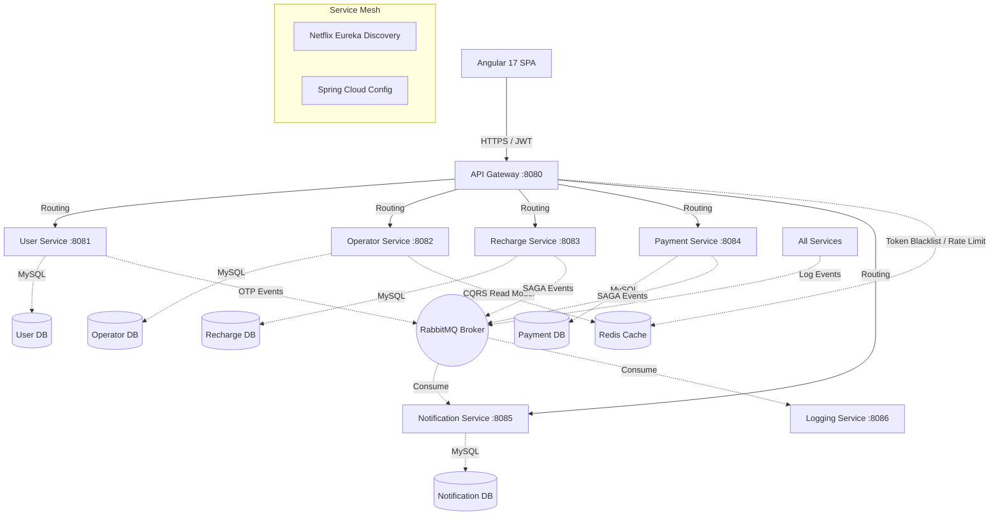

<div align="center">
  
  <h1>⚡ OmniCharge Platform</h1>
  <p><strong>Enterprise-Grade Microservices Mobile Recharge Ecosystem</strong></p>

  [](https://java.com)
  [](https://spring.io/projects/spring-boot)
  [](https://angular.io)
  [](https://rabbitmq.com)
  [](https://redis.io)
  [](https://mysql.com)
</div>

<br/>

OmniCharge is a highly scalable, fault-tolerant mobile recharge platform architected for the cloud. It orchestrates the complete recharge lifecycle—from network operator detection and plan selection to secure Razorpay checkout and instant notification delivery.

It implements modern distributed system patterns including **SAGA Choreography, CQRS (Command Query Responsibility Segregation), the Outbox Pattern**, and **Service Mesh Routing**.

---

## 🚀 Key Features

*   **📱 Instant Operator Detection:** Integrates with the Numverify API to automatically detect telecom operators based on mobile numbers, backed by aggressive Redis caching.
*   **⚡ Sub-Millisecond Plan Retrieval:** Uses a CQRS read-model in Redis to serve massive read volumes for recharge plans without hitting the SQL database.
*   **💸 Secure Payment Processing:** Integrates Razorpay with robust SAGA event-driven transaction fulfillment and automated rollback sweeps for abandoned checkouts.
*   **🔐 Zero-Trust Security:** API Gateway validates stateless JWTs against a Redis Blacklist, injecting trust headers downstream. Supports Google OAuth 2.0 and OTP authentication.
*   **🛡️ Ironclad Fault Tolerance:** Implements Resilience4j Circuit Breakers, Retry policies, and Fallback methods for all inter-service HTTP communication (OpenFeign).
*   **📊 100% Audit Logging:** Implements the **Outbox Pattern** to guarantee zero-data-loss audit logging to ELK (Elasticsearch, Logstash, Kibana) even during RabbitMQ broker outages.
*   **✨ Reactive Frontend:** Built on Angular 17 utilizing the new Signals API for synchronous, boilerplate-free state management.

---

## 🏗️ Microservices Architecture

OmniCharge is composed of 9 discrete Spring Boot applications, enforcing strict data isolation (Database-per-Service).



---

## 🛠️ Technology Stack

**Backend System:**
*   Java 17 & Spring Boot 3.5.x
*   Spring Cloud Gateway (WebFlux / Reactive)
*   Spring Cloud Netflix Eureka (Service Registry)
*   Spring Cloud Config (Centralized Properties)
*   Spring Cloud OpenFeign & Resilience4j

**Data & Messaging:**
*   MySQL 8.0 (5 Isolated Schemas)
*   Redis 7 (Caching, Rate Limiting, Read Models)
*   RabbitMQ (Topic Exchanges, SAGA Orchestration)

**Frontend:**
*   Angular 17 (Signals, Standalone Components)
*   Tailwind CSS (Utility-first styling)
*   Razorpay Checkout.js

**Observability:**
*   Prometheus & Grafana
*   Zipkin / Micrometer Tracing
*   ELK Stack (Elasticsearch, Logstash, Kibana)

---

## ⚙️ Local Development Setup

### 1. Prerequisites
*   Docker & Docker Compose v2
*   Java 17 / Maven 3.9+
*   Node.js 20+ / Angular CLI 17+

### 2. Environment Configuration
Clone the repository and configure your secrets:
```bash
git clone https://github.com/yourusername/OmniCharge.git
cd OmniCharge
cp .env.example .env
```
*Fill in the `.env` with your Razorpay, Twilio, and Numverify API keys.*

### 3. Bootstrapping Infrastructure
Start the backing services (Database, Broker, Cache):
```bash
docker-compose up -d mysql redis rabbitmq
```

### 4. Build & Run Microservices
Compile all Spring Boot services:
```bash
mvn clean package -DskipTests
```
Boot the service mesh first, then the business services:
```bash
docker-compose up -d config-server
# Wait 10 seconds for config-server to be healthy
docker-compose up -d eureka-server
# Wait for eureka, then start the rest
docker-compose up -d
```

### 5. Start the Frontend
```bash
cd omnicharge-ui
npm install
npm start
```
*The application will be available at `http://localhost:4200`.*
*Api Docs will be available at `http://localhost:8080/webjars/swagger-ui/index.html`.*

---

## 📚 Comprehensive Documentation
For an exhaustive deep-dive into the SAGA implementation, CQRS flows, Security architecture, Database schemas, and Event Catalogs, please read the [OmniCharge Technical Documentation](./OmniCharge_Technical_Documentation.md).

---

## 📝 License
This project is licensed under the MIT License.
